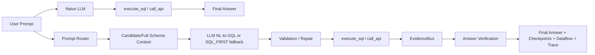

# Baseline Comparison Report

## Summary Table

| System | Description | Normal correctness | Strict correctness | Final score | Tool calls | Tokens | LLM status |
| --- | --- | ---: | ---: | ---: | ---: | ---: | --- |
| REAL_LLM_TWO_TOOLS_BASELINE | Real naive LLM with execute_sql/call_api only |  |  |  |  |  | real_llm_called_but_tool_loop_failed |
| LLM_FREE_AGENT_BASELINE | Deterministic approximation of a broad LLM agent | 0.6707 | 0.4879 | 0.4533 | 2.1143 | 975.9429 | n/a |
| SQL_ONLY_BASELINE | Local DB only | 0.5763 | 0.2983 | 0.2799 | 1.0 | 708.4571 | n/a |
| SQL_FIRST_API_VERIFY | Current deterministic optimized backend | 0.8407 | 0.6743 | 0.649 | 1.4571 | 851.7714 | n/a |
| CANDIDATE_GUIDED_LLM_SQL | Optional candidate-context LLM SQL with fallback |  |  |  |  |  | n/a |
| FULL_SCHEMA_LLM_SQL | Optional full-schema LLM SQL with fallback |  |  |  |  |  | n/a |
| LLM_SQL_FIRST_API_VERIFY | Optional LLM SQL plus deterministic API verification |  |  |  |  |  | n/a |
| LLM_CONTROLLER_OPTIMIZED_AGENT | Optional LLM controller with optimized backend tool |  |  |  |  |  | valid_tool_agent_run |

## Failed Real LLM Tool Loops

Real LLM called but tool loop failed. These rows are not treated as successful real tool-using baseline runs.

| Query ID | Tool calls | Tool calls executed? | Failure reason |
| --- | ---: | --- | --- |
| `example_000` | 0 | False | invalid_tool_call_format_after_retry |
| `example_001` | 0 | False | invalid_tool_call_format_after_retry |
| `example_002` | 0 | False | invalid_tool_call_format_after_retry |
| `example_003` | 0 | False | invalid_tool_call_format_after_retry |
| `example_004` | 0 | False | invalid_tool_call_format_after_retry |
| `example_005` | 0 | False | invalid_tool_call_format_after_retry |
| `example_006` | 0 | False | invalid_tool_call_format_after_retry |
| `example_007` | 0 | False | invalid_tool_call_format_after_retry |
| `example_008` | 0 | False | invalid_tool_call_format_after_retry |
| `example_009` | 0 | False | invalid_tool_call_format_after_retry |
| `example_010` | 0 | False | invalid_tool_call_format_after_retry |
| `example_011` | 0 | False | invalid_tool_call_format_after_retry |
| `example_012` | 0 | False | invalid_tool_call_format_after_retry |
| `example_013` | 0 | False | invalid_tool_call_format_after_retry |
| `example_014` | 0 | False | invalid_tool_call_format_after_retry |
| `example_015` | 0 | False | invalid_tool_call_format_after_retry |
| `example_016` | 0 | False | invalid_tool_call_format_after_retry |
| `example_017` | 0 | False | invalid_tool_call_format_after_retry |
| `example_018` | 0 | False | invalid_tool_call_format_after_retry |
| `example_019` | 0 | False | invalid_tool_call_format_after_retry |

## Improvement: Optimized vs Naive

| Metric | Naive | Optimized | Absolute gain | Relative gain |
| --- | ---: | ---: | ---: | ---: |
| SQL correctness | 0.06 | 0.9333 | 0.8733 | 14.555 |
| API correctness | 0.9742 | 0.9791 | 0.0049 | 0.005 |
| answer correctness | 0.245 | 0.3076 | 0.0626 | 0.2555 |
| overall correctness | 0.4879 | 0.6743 | 0.1864 | 0.382 |
| final score | 0.4533 | 0.649 | 0.1957 | 0.4317 |
| tool calls | 2.1143 | 1.4571 | -0.6572 | -0.3108 |
| tokens | 975.9429 | 851.7714 | -124.1715 | -0.1272 |
| runtime | 0.0157 | 0.0089 | -0.0068 | -0.4331 |

## Technique Contribution

| Technique | Active in naive baseline? | Active in optimized system? | Expected effect |
| --- | --- | --- | --- |
| prompt router | False | True | keeps conceptual prompts out of the data pipeline and routes evidence prompts safely |
| query normalization | False | True | improves correctness, efficiency, or observability in the optimized path |
| token extraction | False | True | improves correctness, efficiency, or observability in the optimized path |
| candidate context retrieval | False | True | narrows schema/API context without deciding final SQL |
| full-schema fallback | False | True | prevents retrieval misses from blocking NL-to-SQL |
| LLM NL-to-SQL | True | True | lets a real model generate SQL when credentials exist |
| SQL/API templates | False | True | improves correctness, efficiency, or observability in the optimized path |
| plan optimizer | False | True | improves correctness, efficiency, or observability in the optimized path |
| evidence policy | False | True | improves correctness, efficiency, or observability in the optimized path |
| call budget | False | True | improves correctness, efficiency, or observability in the optimized path |
| EvidenceBus | False | True | forwards exact SQL/API evidence into later steps |
| answer verifier | False | True | blocks unsupported final-answer claims |
| answer reranker | False | True | improves correctness, efficiency, or observability in the optimized path |
| checkpoint visualization | False | True | improves correctness, efficiency, or observability in the optimized path |
| OpenAI trace export | False | True | improves correctness, efficiency, or observability in the optimized path |

## System Comparison Diagram

## Lowest Failure Deltas

| Query ID | Naive final | Optimized final | Delta | Likely reason |
| --- | ---: | ---: | ---: | --- |
| `example_004` | 0.8355 | 0.835 | -0.0005 | optimized path uses validated templates/evidence policy/checkpoints |
| `example_020` | 0.7878 | 0.8008 | 0.013 | optimized path uses validated templates/evidence policy/checkpoints |
| `example_022` | 0.8014 | 0.8144 | 0.013 | optimized path uses validated templates/evidence policy/checkpoints |
| `example_026` | 0.7979 | 0.8109 | 0.013 | optimized path uses validated templates/evidence policy/checkpoints |
| `example_015` | 0.7947 | 0.8078 | 0.0131 | optimized path uses validated templates/evidence policy/checkpoints |
| `example_034` | 0.7969 | 0.81 | 0.0131 | optimized path uses validated templates/evidence policy/checkpoints |
| `example_029` | 0.7811 | 0.7945 | 0.0134 | optimized path uses validated templates/evidence policy/checkpoints |
| `example_017` | 0.7897 | 0.8032 | 0.0135 | optimized path uses validated templates/evidence policy/checkpoints |
| `example_027` | 0.7953 | 0.8088 | 0.0135 | optimized path uses validated templates/evidence policy/checkpoints |
| `example_033` | 0.7838 | 0.7973 | 0.0135 | optimized path uses validated templates/evidence policy/checkpoints |
